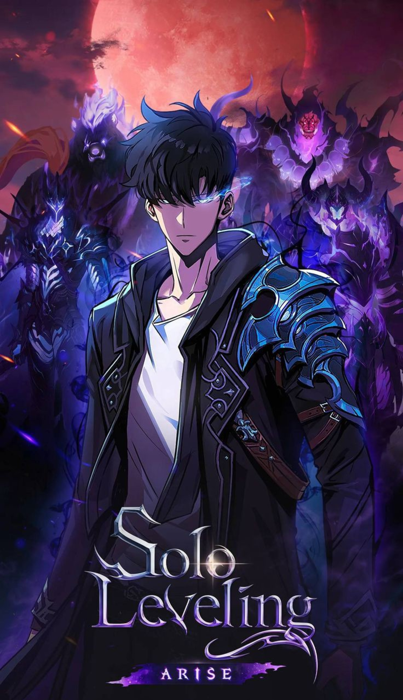

<!-- 🔥 Animated Header -->

# 👋 Hi, I'm Jebickson Samuel

💻 Aspiring Software Engineer  
📍 Chennai, India  

---

## 🧑‍💻 About Me
- 🎓 B.Sc Computer Science Graduate  
- 🚀 Building Web & Real-time Applications  
- 🔥 Currently learning Full Stack Development  
- 🎯 Goal: Get a Software Engineer Job  

---

## 🧠 Tech Stack

### 🚀 Frontend
- HTML, CSS, JavaScript  
- React, Next.js  
- Tailwind CSS  

### ⚙️ Backend
- Node.js, Express  
- Java (Basics)  
- MySQL, MongoDB  

### 🛠 Tools
- Git & GitHub  
- VS Code  
- Firebase, Vercel  

---

## 📊 GitHub Stats

---

## 🔥 Current Focus
- 🧩 Improving problem-solving skills  
- ⚡ Building real-world projects  

---

## 🎯 Goals
- Build real-world apps  
- Contribute to open source  

---

## 🖼️ My Banner

---

## 📫 Contact
- 📧 Email: yourmail@gmail.com  
- 🔗 LinkedIn: https://linkedin.com/in/yourprofile  

---

<!-- 🔥 Footer -->

